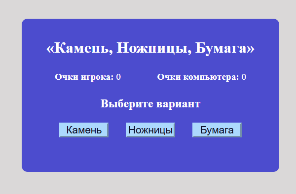
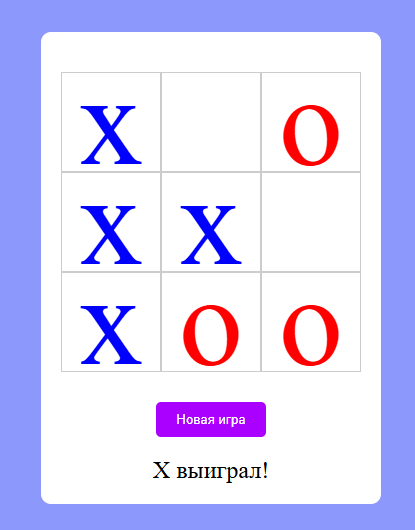

# В этом репозиторию представлены мини игры

## 1. Камень, ножницы, бумага

### Правила игры: 
Вы будете играть против компьютера. Побеждает тот, кто первым наберет три очка. Если варианты равны, то никто не получает очко.

Как набрать очко в игре:
1) Камень бьет Ножницы
2) Ножницы бьют Бумагу
3) Бумага бьет Камень

## 2. Крестики-нолики

### Правила игры: 
Игроки ходят по очереди. Побеждает тот, кто первым расположит подряд три своих символа. Если в каждой клетке расположен символ и нет трёх подряд, то игра завершается ничьёй.

Как победить в игре:
1) Расположить подряд три своих символа в любой строке
2) Расположить подряд три своих символа в любой колонне
3) Расположить подряд три своих символа в любой диагонали

## 3. Пинг-понг

### Описание игры: 
Для игры нужно двигать ракетки. Сверху отображается счёт игры.

Левая ракетка: <kbd>q</kbd> - движение вверх, <kbd>s</kbd> - движение вниз.
Правая ракетка: <kbd>ArrowUp</kbd> - движение вверх, <kbd>ArrowDown</kbd> - движение вниз.

## 4. Змейка

### Описание игры:
Управляя змейкой нужно поедать еду. Сверху отображается счёт игры и персональный рекорд.

<kbd>ArrowUp</kbd> - движение вверх, <kbd>ArrowDown</kbd> - движение вниз.
<kbd>ArrowLeft</kbd> - движение влево, <kbd>ArrowRight</kbd> - движение вправо.

## 5. Игра на память

### Описание игры: 
Нужно найти все пары за отведённое время.

